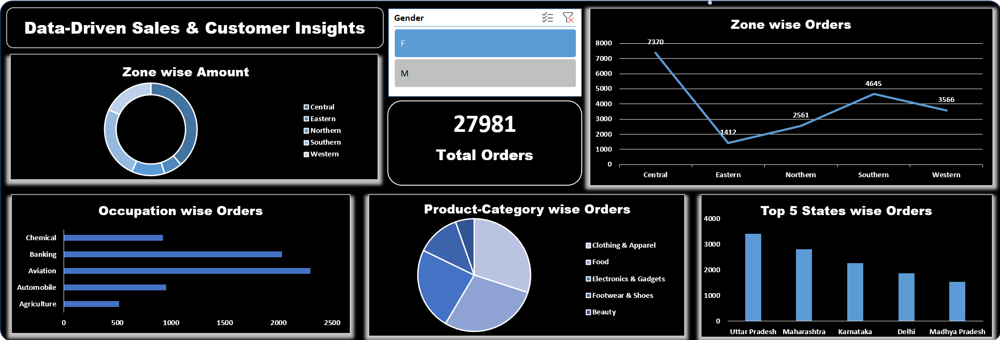
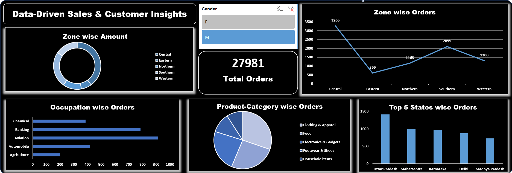

# Data-Driven Sales & Customer Insights Dashboard

## 📌 Project Overview

This project analyzes customer and sales data using Excel to uncover key business insights related to customer behavior, regional performance, and product trends. The goal is to support data-driven decision-making through an interactive dashboard.
It simulates a real-world business scenario to identify key revenue drivers and underperforming regions.

## 🎯 Business Problem

Businesses often struggle to identify which regions, products, and customer segments drive the most sales. This project aims to solve that by analyzing sales data and highlighting actionable insights.

## 🛠 Tools Used

* Microsoft Excel (Pivot Tables, Power Query, Dashboarding)
* SQL (Data extraction and preprocessing)

## 🔍 Analysis Performed

* Data cleaning and preprocessing (handling missing values, formatting)
* Customer segmentation based on demographics
* Regional and state-level performance analysis
* Product category performance evaluation

## 📊 Key Insights

* Central zone contributes the highest number of orders, indicating strong market concentration in specific regions.
* Eastern zone shows the lowest contribution, highlighting an opportunity for targeted growth and expansion.
* Clothing & Apparel category generates the highest number of orders, making it the top-performing product segment
* Uttar Pradesh and Maharashtra are the leading states in terms of order volume, contributing significantly to overall sales.
* Customers from Aviation and Banking sectors show higher engagement compared to other occupations.
* A significant portion of sales is concentrated in a few regions, indicating dependency on limited markets.

## 📈 Dashboard Features

* Interactive dashboard with slicer (Gender filter)
* KPI card displaying total number of orders
* Visualizations for zone-wise, state-wise, and category-wise analysis

## 📂 Files Included

* Excel Dashboard File
* Project Presentation (PPT)
* Dashboard Screenshots

## 📸 Dashboard Preview

### 🔹 Overall Dashboard View

### 🔹 Filtered View

## 🚀 Conclusion

This analysis provides meaningful insights into customer behavior and sales performance, helping businesses make informed decisions and focus on high-performing areas for growth.

